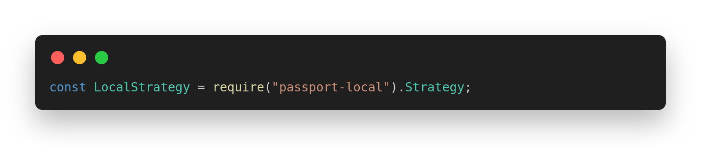

# Blog Academico Backend #

## **Estructura del Proyecto**

```
.
├───config
│       dbConfig.js              # Configuración de la conexión a la BD
│       passportConfig.js        # Configuración de passport(utilizado para la autenticación)
│
├───controllers
│       userController.js         # Los controladores se encargan de manejar las solicitudes HTTP
│       questionController.js        
│		...
|
│───middleware
│        authMiddleware.js   # Funciones para verificar si un usuario se encuentra o no autenticado
|        
├───models
│       userModel.js        # Los models interactuan directamente con la BD mediante querys
│       questionModel.js             
│		...
|───routes
|        userRoutes.js	     # Rutas/endpoints del backend
|        questionRoutes.js 
|           
└─── server.js              # Main file     
```


## Inicializar el proyecto ##
- *Clonar el repositorio*
 ```bash
     git clone  url_repo
```
- *Colocarse dentro de la carpeta backend*
```bash
	cd backend
```
- *Inicializar el servidor(Se ejecutará en el puerto 4000)
```bash
	npm run dev 
```
   
- *En caso de no tener npm instalado*
```bash
	sudo apt install npm
```
-  *Instalar algunas librerías* 
```bash 
	npm install express passport cors bcrypt
```

## Conceptos clave ##
- *API*
	- API (Interfaz de Programación de Aplicaciones, o Application Programming Interface en inglés) es un conjunto de  protocolos que permite a diferentes programas comunicarse entre sí. 
	- Las APIs permiten que los sistemas intercambien datos o funciones sin necesidad de conocer el código interno del otro, brindando acceso a funcionalidades específicas de forma controlada y segura.
	- En el contexto de aplicaciones web, una Web API es un servicio que permite la comunicación entre un cliente (como una aplicación frontend) y un servidor. Este tipo de API suele ofrecer operaciones CRUD,  que permiten interactuar con los datos almacenados en el servidor de una aplicación, facilitando la interacción con bases de datos y otros recursos.
	- RESTful APIs: Siguen el estilo de arquitectura REST, donde cada recurso tiene una URL única y se manipula usando métodos HTTP. Son las más comunes para aplicaciones web. *_Este tipo de API es la que desarrollaremos_*
- Middleware: software que se sitúa entre un sistema operativo y las aplicaciones que se ejecutan en él. Básicamente, funciona como una capa de traducción oculta para permitir la comunicación y la administración de datos en aplicaciones distribuidas. 
	- En el contexto del desarrollo web se usa más específicamente para referirse a componentes de software prediseñados 
	que se pueden agregar al proceso de procesamiento de solicitudes/respuestas  para manejar tareas como el acceso a la base de datos.

## Herramientas ##
- **Node.js**: Entorno de ejecución para JavaScript del lado del servidor. Fue diseñado para crear aplicaciones de red rápidas y escalables.
	-   Asincronía y no bloqueo: Node.js maneja las operaciones de entrada/salida de forma asincrónica y no bloqueante, lo que permite procesar muchas solicitudes a la vez sin que se ralentice el servidor.
	Una función asincrona se refiere a una funcion que espera una "respuesta".Mientras no la reciba, la ejecución no culminará, aunque de todas formas se podrán seguir ejecutando otras funciones.
	- Uso compartido de JavaScript: Al usar JavaScript tanto en el cliente como en el servidor, puedes reutilizar lógica y funciones, lo que facilita el desarrollo full-stack.
    -Velocidad y escalabilidad: Basado en el motor V8 de Chrome, Node.js es muy rápido, lo que lo hace ideal para aplicaciones en tiempo real como chats o streaming de datos.
    - Comunidad y ecosistema: NPM (Node Package Manager) ofrece miles de paquetes de terceros, desde bases de datos hasta autenticación y manejo de formularios, que facilitan la creación rápida de aplicaciones.
    -	Facilidad para APIs RESTful: Su estructura y librerías como Express permiten construir APIs eficientes y ligeras para manejar datos y comunicar el frontend con el backend.

- **Express**: Desde el inicio de Nodejs, uno de los frameworks que más se popularizó fue Express, este es un framework minimalista, lo que quiere decir que es un pequeño paquete (npm install express) que instalas y puedes extenderlo con otros modulos, a partir de alli.

- **Passport**:Passport es un middleware de autenticación para Node.js que nos permite implementar fácilmente un sistema de inicio de sesión y registro de usuarios con diferentes métodos de autenticación. 
	- Flexibilidad: Ofrece una variedad de estrategias (módulos preconstruidos), lo que permite autenticación a través de nombres de usuario y contraseña, así como autenticación de terceros (Google, Facebook, etc.).	_En nuestro caso, estamos utilizando de momento una autenticación local(usuario y contraseña)_
	
	
    - Sesiones y Tokens: Passport maneja sesiones de usuario con cookies en aplicaciones tradicionales o usa tokens (como JWT).
		
	- Serializar y Deserializar: Passport necesita funciones para serializar (guardar) y deserializar (recuperar) al usuario en una sesión.

- **CORS**: Cross-Origin Resource Sharing. Es un mecanismo de seguridad que permite a los navegadores web controlar las solicitudes HTTP que se realizan desde JavaScript, y que provienen de un origen distinto al del servidor.    
	


- Middleware en rutas para protegerlas.


- **Bcrypt**:Biblioteca de hashing que se usa para cifrar contraseñas de manera segura antes de guardarlas en la base de datos. Sus principales beneficios son:
	
   - Salting: Genera un "salt" único para cada contraseña, lo que significa que incluso si dos usuarios tienen la misma contraseña, los hashes serán diferentes.
    - Verificación Simple: bcrypt también ofrece métodos para comparar un hash almacenado con una contraseña en texto claro, facilitando la autenticación de usuarios.
	- Hashing Seguro: bcrypt utiliza un algoritmo que aplica múltiples rondas de encriptación (cost factor), lo que lo hace resistente a ataques de fuerza bruta.


- **PostgreSQL**:   Ideal para sistemas que requieren integridad de datos y consultas complejas, como en la búsqueda y filtrado de cursos. Su soporte para tipos de datos avanzados, índices y funciones SQL enriquecidas permite gestionar datos con eficiencia.
    - Soporte para relaciones complejas: En un proyecto con varias entidades relacionadas (usuarios, cursos, comentarios), PostgreSQL facilita las relaciones entre tablas mediante claves foráneas, ofreciendo integridad referencial.
   

- **EJS** (Embedded JavaScript): Motor de plantillas para Node.js que permite insertar JavaScript en archivos HTML. Con EJS, puedes generar páginas HTML dinámicas de manera sencilla usando variables y estructuras de control de JavaScript en el servidor.


## Funcionamiento ##

# Login/Register #
Sistema básico de registro,logeo. Cuando un usuario se registra correctamente, hashea su contraseña y lo almacena en la base de datos. (Verificación local). Se planea implementar una opción para iniciar sesión mediante cuenta de un servicio tercero como Google.


# Cursos #
El usuario podrá navegar por todo un catálogo de cursos con sus respectivos cursos (Falta implementar, todavía no definimos exactamente que datos debe contener la tabla cursos)


# Preguntas #
El usuario podrá acceder a un foro donde podrá realizar preguntas, responder preguntas e incluso calificar respuestas (Similar a StackOverflow)

Se realizan operaciones CRUD
Create


Read


Cabe resaltar que para la ruta questions/:id, brindamos el id mediante parámetro(en la misma url), mientras que en las otras operaciones brindamos los datos mediante un .json(body request)


Update


Delete


Cuando se elimina una pregunta, también se eliminan las respuestas	


